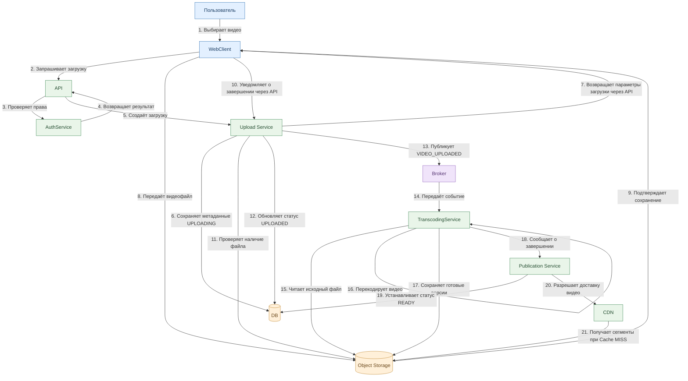

# Сценарий 1. Пользователь загружает видео в YouTube

## Схема

```mermaid
flowchart TD
    U["Пользователь"]
    C["WebClient"]
    API["API"]
    AUTH["AuthService"]
    UP["Upload Service"]
    OBJ[("Object Storage")]
    DB[("DB")]
    MQ["Broker"]
    TC["TranscodingService"]
    PUB["Publication Service"]
    CDN["CDN"]

    U -->|"1. Выбирает видео"| C
    C -->|"2. Запрашивает загрузку"| API
    API -->|"3. Проверяет права"| AUTH
    AUTH -->|"4. Возвращает результат"| API

    API -->|"5. Создаёт загрузку"| UP
    UP -->|"6. Сохраняет метаданные UPLOADING"| DB
    UP -->|"7. Возвращает параметры загрузки через API"| C

    C -->|"8. Передаёт видеофайл"| OBJ
    OBJ -->|"9. Подтверждает сохранение"| C
    C -->|"10. Уведомляет о завершении через API"| UP
    UP -->|"11. Проверяет наличие файла"| OBJ
    UP -->|"12. Обновляет статус UPLOADED"| DB

    UP -->|"13. Публикует VIDEO_UPLOADED"| MQ
    MQ -->|"14. Передаёт событие"| TC

    TC -->|"15. Читает исходный файл"| OBJ
    TC -->|"16. Перекодирует видео"| TC
    TC -->|"17. Сохраняет готовые версии"| OBJ

    TC -->|"18. Сообщает о завершении"| PUB
    PUB -->|"19. Устанавливает статус READY"| DB
    PUB -->|"20. Разрешает доставку видео"| CDN
    CDN -->|"21. Получает сегменты при Cache MISS"| OBJ

    classDef client fill:#e3f0ff,stroke:#3978b8,color:#183b62
    classDef service fill:#e9f5e9,stroke:#438c59,color:#244d30
    classDef storage fill:#fff0d9,stroke:#c28b38,color:#694619
    classDef async fill:#f0e4fa,stroke:#9566be,color:#563573

    class U,C client
    class API,AUTH,UP,TC,PUB,CDN service
    class DB,OBJ storage
    class MQ async
```