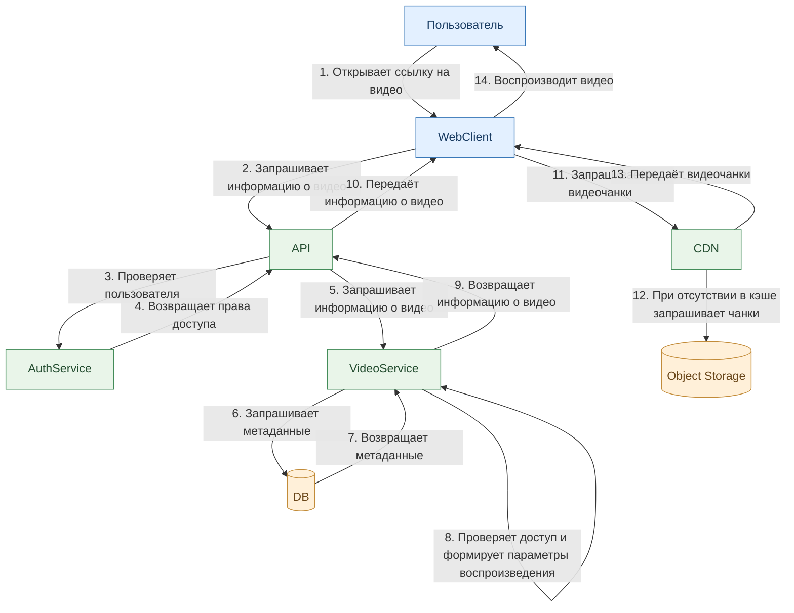

# Сценарий 2: Пользователь открывает видео по ссылке
## Схема 

```mermaid
flowchart TD
    U["Пользователь"]
    C["WebClient"]
    API["API"]
    AUTH["AuthService"]
    VS["VideoService"]
    DB[("DB")]
    CDN["CDN"]
    OBJ[("Object Storage")]

    U -->|"1. Открывает ссылку на видео"| C

    C -->|"2. Запрашивает информацию о видео"| API
    API -->|"3. Проверяет пользователя"| AUTH
    AUTH -->|"4. Возвращает права доступа"| API

    API -->|"5. Запрашивает информацию о видео"| VS
    VS -->|"6. Запрашивает метаданные"| DB
    DB -->|"7. Возвращает метаданные"| VS

    VS -->|"8. Проверяет доступ и формирует параметры воспроизведения"| VS
    VS -->|"9. Возвращает информацию о видео"| API
    API -->|"10. Передаёт информацию о видео"| C

    C -->|"11. Запрашивает видеочанки"| CDN
    CDN -->|"12. При отсутствии в кэше запрашивает чанки"| OBJ
    CDN -->|"13. Передаёт видеочанки"| C

    C -->|"14. Воспроизводит видео"| U

    classDef client fill:#e3f0ff,stroke:#3978b8,color:#183b62
    classDef service fill:#e9f5e9,stroke:#438c59,color:#244d30
    classDef storage fill:#fff0d9,stroke:#c28b38,color:#694619

    class U,C client
    class API,AUTH,VS,CDN service
    class DB,OBJ storage
```
