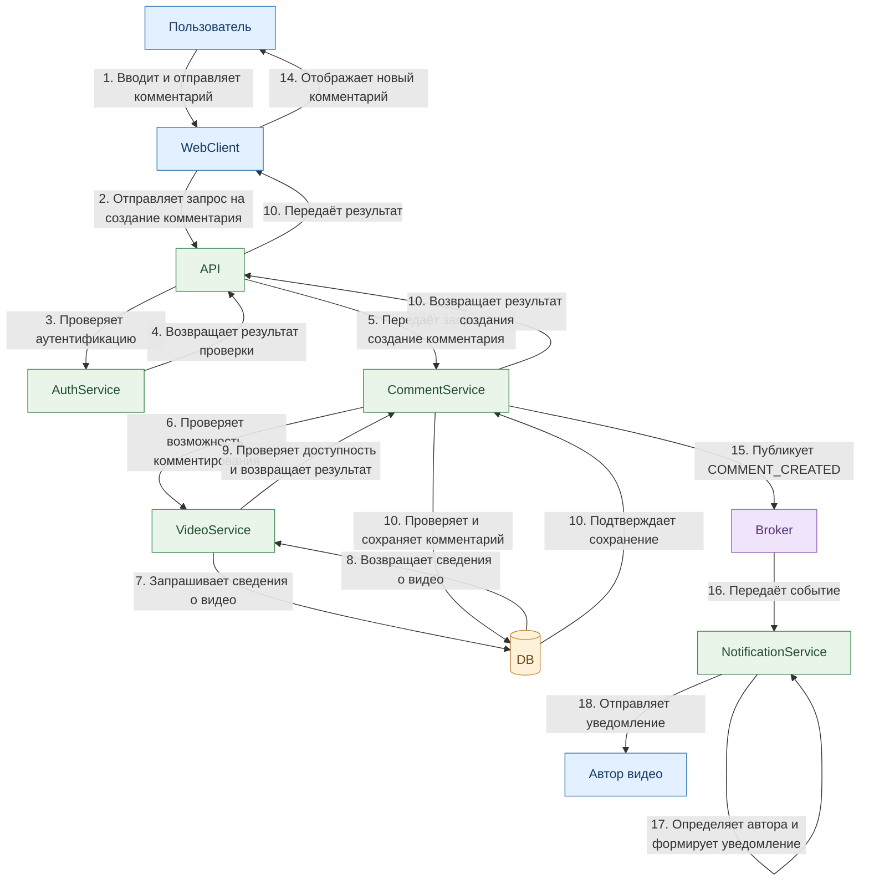

# Сценарий 3. Пользователь оставляет комментарий к видео в YouTube

## Схема

```mermaid
flowchart TD
    U["Пользователь"]
    C["WebClient"]
    API["API"]
    AUTH["AuthService"]
    VS["VideoService"]
    CS["CommentService"]
    DB[("DB")]
    MQ["Broker"]
    NS["NotificationService"]
    AUTHOR["Автор видео"]

    U -->|"1. Вводит и отправляет комментарий"| C

    C -->|"2. Отправляет запрос на создание комментария"| API
    API -->|"3. Проверяет аутентификацию"| AUTH
    AUTH -->|"4. Возвращает результат проверки"| API

    API -->|"5. Передаёт запрос на создание комментария"| CS

    CS -->|"6. Проверяет возможность комментирования"| VS
    VS -->|"7. Запрашивает сведения о видео"| DB
    DB -->|"8. Возвращает сведения о видео"| VS
    VS -->|"9. Проверяет доступность и возвращает результат"| CS

    CS -->|"10. Проверяет и сохраняет комментарий"| DB
    DB -->|"10. Подтверждает сохранение"| CS
    CS -->|"10. Возвращает результат создания"| API
    API -->|"10. Передаёт результат"| C

    C -->|"14. Отображает новый комментарий"| U

    CS -->|"15. Публикует COMMENT_CREATED"| MQ
    MQ -->|"16. Передаёт событие"| NS

    NS -->|"17. Определяет автора и формирует уведомление"| NS
    NS -->|"18. Отправляет уведомление"| AUTHOR

    classDef client fill:#e3f0ff,stroke:#3978b8,color:#183b62
    classDef service fill:#e9f5e9,stroke:#438c59,color:#244d30
    classDef storage fill:#fff0d9,stroke:#c28b38,color:#694619
    classDef async fill:#f0e4fa,stroke:#9566be,color:#563573

    class U,C,AUTHOR client
    class API,AUTH,VS,CS,NS service
    class DB storage
    class MQ async
```
